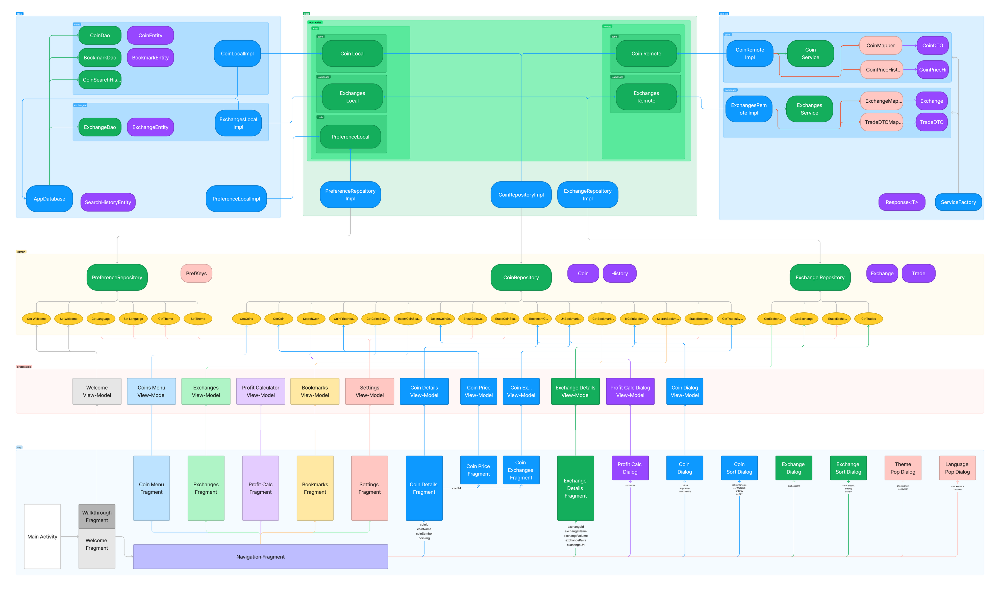

<h1 align="center">
  <a href="https://github.com/hexley21/CoinFuse">
    <!-- Please provide path to your logo here -->
    
  </a>
</h1>

  CoinFuse
   
  <a href="#about"><strong>Explore the screenshots »</strong></a>
   
   
  <a href="https://github.com/hexley21/CoinFuse/issues/new?assignees=&labels=bug&template=01_BUG_REPORT.md&title=bug%3A+">Report a Bug</a>
  ·
  <a href="https://github.com/hexley21/CoinFuse/issues/new?assignees=&labels=enhancement&template=02_FEATURE_REQUEST.md&title=feat%3A+">Request a Feature</a>
  .
  <a href="https://github.com/hexley21/CoinFuse/issues/new?assignees=&labels=question&template=04_SUPPORT_QUESTION.md&title=support%3A+">Ask a Question</a>

 

Table of Contents

- [About](#about)
  - [Built With](#built-with)
- [Roadmap](#roadmap)
- [Support](#support)
- [Project assistance](#project-assistance)
- [Contributing](#contributing)
- [Authors \& contributors](#authors--contributors)
- [Security](#security)
- [License](#license)
- [Acknowledgements](#acknowledgements)

---

## About

CoinFuse is a powerful and user-friendly platform for tracking cryptocurrency market capitalization and gaining insights into the world of cryptocurrencies. With real-time data, comprehensive coin information, and more, our app simplifies the complex world of crypto for enthusiasts, traders, and investors. Join us on this exciting journey of exploring and analyzing the crypto market.

Screenshots

| Coin Menu      | Coin Details     |
|:--------------:|:----------------:|
|  |  |

| Coin Exchanges | Exchanges Menu   |
|:--------------:|:----------------:|
|  |  |

| Exchange Details | Profit Calculator |
|:--------------:|:----------------:|
|  |  |

Dark

| Coin Menu      | Coin Details     |
|:--------------:|:----------------:|
|  |  |

| Coin Exchanges | Exchanges Menu   |
|:--------------:|:----------------:|
|  |  |

| Exchange Details | Profit Calculator |
|:--------------:|:----------------:|
|  |  |

 

### Built With

The CoinFuse app follows a modular architecture that promotes separation of concerns and modularity. It consists of the following modules, each responsible for specific functionality:

- **App Module**: The main module of the app that encompasses the UI elements and user interface-related functionalities. It utilizes the following Android Architecture Components:
  - LiveData: Used for data observation and propagation between the view-models and UI components.
  - Data Binding: Binds UI components in layouts to data sources, simplifying UI updates.

- **Presentation Module**: This module contains the view-models responsible for orchestrating the interaction between the UI components and the domain layer. It utilizes LiveData for reactive data updates.
  - ViewModel: Stores and manages UI-related data, ensuring data survives configuration changes.

- **Domain Module**: Encapsulates the core business logic and use cases of the app. It defines interfaces and contracts that the data layer must implement.

- **Data Module**: Implements the repositories defined in the domain module and acts as a bridge between the domain and the external data sources. It incorporates the following Android Architecture Components:
  - Room: Handles local database caching and retrieval.

- **Remote Module**: Handles data retrieval from external APIs and utilizes Retrofit for network communication.

- **Local Module**: An Android-specific module that focuses on storing and accessing data locally. It includes Room for local database caching and Shared Preferences for managing application preferences.

By following this modular architecture, the CoinFuse app achieves a clean separation of concerns, promotes code reusability, and facilitates easy maintenance and testing. The app also incorporates several Android Architecture Components, such as LiveData, ViewModel, Data Binding, and Room, to enhance its functionality and provide a smooth user experience.

Figma jam diagram

## Roadmap

See the [open issues](https://github.com/hexley21/CoinFuse/issues) for a list of proposed features (and known issues).

- [Top Feature Requests](https://github.com/hexley21/CoinFuse/issues?q=label%3Aenhancement+is%3Aopen+sort%3Areactions-%2B1-desc) (Add your votes using the 👍 reaction)
- [Top Bugs](https://github.com/hexley21/CoinFuse/issues?q=is%3Aissue+is%3Aopen+label%3Abug+sort%3Areactions-%2B1-desc) (Add your votes using the 👍 reaction)
- [Newest Bugs](https://github.com/hexley21/CoinFuse/issues?q=is%3Aopen+is%3Aissue+label%3Abug)

## Support

Reach out to the maintainer at one of the following places:

- [GitHub issues](https://github.com/hexley21/CoinFuse/issues/new?assignees=&labels=question&template=04_SUPPORT_QUESTION.md&title=support%3A+)
- Contact options listed on [this GitHub profile](https://github.com/hexley21)

## Project assistance

If you want to say **thank you** or/and support active development of CoinFuse:

- Add a [GitHub Star](https://github.com/hexley21/CoinFuse) to the project.
- Tweet about the CoinFuse.
- Write interesting articles about the project on [Dev.to](https://dev.to/), [Medium](https://medium.com/) or your personal blog.

Together, we can make CoinFuse **better**!

## Contributing

First off, thanks for taking the time to contribute! Contributions are what make the open-source community such an amazing place to learn, inspire, and create. Any contributions you make will benefit everybody else and are **greatly appreciated**.

Please read [our contribution guidelines](docs/CONTRIBUTING.md), and thank you for being involved!

## Authors & contributors

The original setup of this repository is by [Avtandil Kupreishvili](https://github.com/hexley21).

For a full list of all authors and contributors, see [the contributors page](https://github.com/hexley21/CoinFuse/contributors).

## Security

CoinFuse follows good practices of security, but 100% security cannot be assured.
CoinFuse is provided **"as is"** without any **warranty**. Use at your own risk.

_For more information and to report security issues, please refer to our [security documentation](docs/SECURITY.md)._

## License

This project is licensed under the **Apache Software License 2.0**.

See [LICENSE](LICENSE) for more information.

## Acknowledgements
- [ongakuer - CircleIndicator](https://github.com/ongakuer/CircleIndicator) - A lightweight indicator like in nexus 5 launcher. (Apache-2.0 license)
- [bumptech - glide](https://github.com/bumptech/glide) - An image loading and caching library for Android focused on smooth scrolling. (Apache-2.0 license)
- [airbnb - lottie](https://github.com/airbnb/lottie-android) - Render After Effects animations natively on Android and iOS, Web, and React Native. (Apache-2.0 license)
- [PhilJay - MPAndroidChart](https://github.com/PhilJay/MPAndroidChart) - A powerful 🚀 Android chart view / graph view library, supporting line- bar- pie- radar- bubble- and candlestick charts as well as scaling, panning and animations. (Apache-2.0 license)
- [facebook - shimmer-android](https://github.com/facebook/shimmer-android) - An easy, flexible way to add a shimmering effect to any view in an Android app. (BSD license)
- [ReactiveX - RxJava](https://github.com/ReactiveX/RxJava) - RxJava – Reactive Extensions for the JVM – a library for composing asynchronous and event-based programs using observable sequences for the Java VM. (Apache-2.0 license)
- [square - retrofit](https://github.com/square/retrofit) - A type-safe HTTP client for Android and the JVM. (Apache-2.0 license)
- [square - okhttp](https://github.com/square/okhttp) - Square’s meticulous HTTP client for the JVM, Android, and GraalVM. (Apache-2.0 license)
- [google - dagger](https://github.com/google/dagger) - A fast dependency injector for Android and Java. (Apache-2.0 license)
- [mockito - mockito](https://github.com/mockito/mockito) - Most popular Mocking framework for unit tests written in Java. (MIT license)
- [robolectric - robolectric](https://github.com/robolectric/robolectric) - Android Unit Testing Framework. (MIT license)
- [google - Material icons](https://fonts.google.com/icons) - Material Design Icons' growing icon collection allows designers and developers targeting various platforms. (Apache-2.0 / Ubuntu font license)
